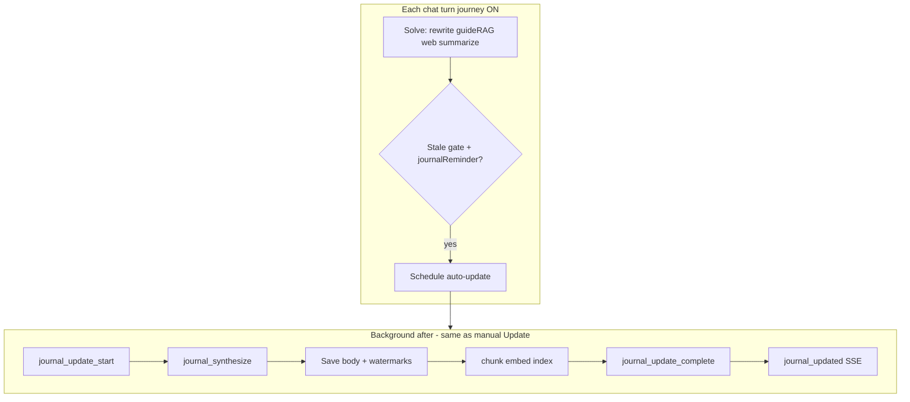

# Player journey tracker (progress journal)

**Status:** Shipped  
**Audience:** Future agents implementing per-game progress journaling  
**Last updated:** 2026-07-28  
**Related:** [user-memory.md](./user-memory.md), [player-memory-game-lifecycle.md](./player-memory-game-lifecycle.md), `lib/guide-rag.ts`, `lib/guide-ingest.ts`, `app/api/solve/route.ts`, `app/chat/active-game-card.tsx`

## Understanding summary

1. **What:** **Track my progress** — a signed-in-only, per-game **long-form journal** that
   records where the player is, what they have, and what they are working toward. The
   journal is chunked and embedded for **RAG recall** on every chat turn when indexed.
2. **Why:** Five-turn chat history and five-bullet style memory are not enough to track
   party/movesets, items, location, or build goals across sessions (Pokemon team vs guide,
   Zelda item flags, etc.). The app should act like a **tukang catet** that listens and
   writes down new progress without the player repeating themselves.
3. **Who:** Signed-in users with `player_journey_enabled` (separate toggle from **Learn my
   style**).
4. **How it updates:** **Mandatory smart auto-update** when summarize detects new concrete
   progress (`journalReminder`). Manual **Update journal** force-refreshes from chat.
   Manual text edit + save re-indexes only (no LLM).
5. **How it recalls:** Journal RAG on **every turn** when chunks exist (parallel to guide
   RAG / web). Sources labeled **PLAYER JOURNAL** in summarize.
6. **Transparency:** Toast on **every** auto/manual journal update (never silent). Full
   `journal_*` trace events for admin Live traces.

## Assumptions

- Users who enable the toggle accept the app synthesizes progress text from their chats.
- Wrong merges will happen; manual edit + force Update are the safety net.
- Auto-update is gated by model signal + throttle so cost stays bounded vs per-turn extract.
- Temporary chats never touch the journal (same as style memory).
- Disabling the feature pauses tracking and RAG; journal rows and chunks are kept until the user clears them or deletes a game.
- Journal is game-agnostic free-form prose, not a Pokemon/Zelda-specific schema.

## Decision log

| Decision | Choice | Alternatives | Why |
|----------|--------|--------------|-----|
| Toggle | Separate **Track my progress** | Bundled with Learn my style | Style vs factual progress are different mental models |
| Journal shape | Long-form `body` text | Structured JSON entities | Game-agnostic; RAG handles recall |
| Update cadence | **Mandatory auto** on new progress signal | Manual only; optional auto sub-toggle | Product vision: tukang catet; user should not rely on remembering Update |
| Detection | `journalReminder` in summarize JSON | Separate LLM stale check; heuristics only | No extra call; model already reads question + journal chunks |
| Nudge UX | **Replaced** by auto-update + toast | "Please update" CTA | Auto handles recording |
| Recall | RAG every turn when indexed | Always inject full body | Scales to long journals |
| Chunk storage | `player_journal_chunks` + RLS | Reuse public `guide_chunks` | Journal is private per user |
| Throttle | 2 min debounce per game (auto only) | Every signal turn; 30 min cooldown | Natural batching without spam updates |
| Daily cap storage | `auto_update_day` + `auto_update_count` on row | Count via `last_auto_updated_at` only | Single timestamp cannot count toward 20/day |
| Single-flight | `updating_at` on row, 5 min stale | Unbounded concurrent updates | Race-safe re-index |
| Manual edit pin | 15 min suppress auto after PATCH save | No pin | Respect user edits |
| First journal | Auto-bootstrap on first qualifying turn | Require manual first Update | Journal starts when player shares progress |
| Toast | Always visible on update | Silent background | User must know when journal changed |
| Trace | Full `journal_*` event chain | Logs only | Debug cost and failures in `/admin/traces` |
| SSE | `journal_updated` event after index completes | Toast only on final JSON | Answer stream not blocked; toast when index done |

## Current baseline (gap)

| Piece | Today | Gap |
|-------|-------|-----|
| Chat history | 5 turns to `/api/solve` | No long-term progress |
| Learn my style | `progress` + 5 notes per game | Unstructured, style-focused, not RAG |
| `lib/guide-progress.js` | RAG retrieval hints for **guide** chunks in-session | Does not persist player state |
| Guide RAG | `guide_chunks` + `match_guide_chunks` | Pattern to reuse, not same table |

---

## Architecture



Manual **Update journal** calls the same `runJournalUpdate({ trigger: "manual" })` pipeline.

---

## Data model

### `user_metadata`

```json
{ "player_journey_enabled": false }
```

Disable confirm: `Turn off progress tracking?`  
Clear all (profile): `Clear all progress journals? This cannot be undone.`

### Table `player_journey` (`db/player-journey.sql`)

```sql
create table public.player_journey (
  user_id uuid not null references auth.users (id) on delete cascade,
  game_key text not null,
  platform text not null default '',
  catalog_game_id integer,
  body text not null default '',
  body_chars int not null default 0,
  last_updated_at timestamptz,
  last_chat_message_at timestamptz,
  last_auto_updated_at timestamptz,
  auto_update_day date,
  auto_update_count int not null default 0,
  manual_save_at timestamptz,
  updating_at timestamptz,
  updated_at timestamptz not null default now(),
  primary key (user_id, game_key, platform)
);
-- RLS: user_id = auth.uid() for all operations
```

| Column | Purpose |
|--------|---------|
| `body` | Full journal text (cap **80_000** chars server-side) |
| `last_chat_message_at` | Watermark: `sinceIso` cursor for `extractUserMessagesFromChats` (not `updated_at`) |
| `last_auto_updated_at` | 2 min debounce for auto trigger |
| `auto_update_day` | UTC calendar day for daily cap (reset counter when day rolls) |
| `auto_update_count` | Auto updates completed on `auto_update_day` (manual Update exempt) |
| `manual_save_at` | 15 min auto suppress after user PATCH edit |
| `updating_at` | Single-flight lock while synthesize/index runs |

### Table `player_journal_chunks` (`db/player-journal-chunks.sql`)

Same embedding shape as `guide_chunks` (1024-dim) but **user-scoped RLS**:

- `(user_id, game_key, platform, chunk_index, chunk_text, embedding)`
- RPC `match_player_journal_chunks(p_user_id, p_game_key, p_platform, p_embedding, p_limit)`
- **No ANN index** on embedding (filter btree first, exact cosine on small set — see `db/guide-chunks.sql` ponytail note)

**Do not** store journal in `guide_chunks` (public read policy).

### Caps

| Limit | Value |
|-------|-------|
| `body` max | 80_000 chars |
| `JOURNAL_AUTO_DAILY_CAP` | 20 auto updates / game / UTC day (`lib/player-journey.js`) |
| Synthesize delta messages | 50 user messages (`MEMORY_DELTA_MESSAGE_CAP`) |
| Per message in synthesize | 800 chars |
| RAG retrieve K | 5 |
| `journalReminder` | 120 chars |
| `journalReminderSummary` | 80 chars |

---

## Mandatory auto-update

### When auto runs

After successful solve, in `after()` (non-blocking), when **all** true:

1. `player_journey_enabled`
2. Not `temporary` chat
3. Not a retry/edit turn (`!isRetry`) — a regenerate must not re-record progress
4. **Stale gate:** `extractUserMessagesFromChats(chats, last_chat_message_at)` returns a
   non-empty delta for this game, OR empty `body` and qualifying turn with `journalReminder`
5. **Signal:** `journalReminder` non-empty from summarize
6. **Not pinned:** `manual_save_at` within last **15 minutes**
7. **Throttle:** `last_auto_updated_at` older than **2 minutes** (auto only)
8. **Daily ceiling:** `auto_update_count < JOURNAL_AUTO_DAILY_CAP` (20) on `auto_update_day`
   (UTC today); reset count to 0 when day changes — hard cost ceiling; debounce bounds
   frequency, not total spend. Increment only on successful `trigger=auto` completes.
9. **Not in-flight:** `updating_at` null or older than 5 minutes

If signal fires but blocked: `journal_update_skipped` trace with `reason`.

### Pipeline (auto and manual)

1. Load delta user messages since `last_chat_message_at` (cap 50, 800 chars/msg)
   via `extractUserMessagesFromChats` — reuse its **chat-row `updated_at` fallback**
   (messages have no reliable per-message `created_at`; see Implementation gotchas)
2. **Replicate** `journal_synthesize`: merge existing `body` + delta → new `body`.
   Prompt rules (not just "merge"): **reconcile contradictions** — when the delta
   updates a fact already in `body` (evolved/sold/moved/completed), rewrite that line
   in place, don't append a second stale one; prefer the newer fact. **Compact** when
   `body` nears the cap: prune superseded/completed state instead of truncating.
3. Upsert `player_journey`, bump `last_updated_at` on success. Set `last_chat_message_at`
   to the **max `at` timestamp among processed delta messages** (not `now()` alone) so
   messages that share the chat row's `updated_at` fallback are not re-ingested on the
   next auto pass. On successful auto: bump `last_auto_updated_at`, increment
   `auto_update_count` (reset when `auto_update_day` ≠ UTC today).
4. Purge chunks → `chunkGuide(body)` → **Sumopod** `embedTexts` → batch insert
5. Emit SSE `journal_updated` + client toast

### Empty journal bootstrap

First turn with stale gate + `journalReminder` → synthesize from chat delta (empty body) → index → toast (e.g. "Journal started").

### Manual Update button

Force refresh from chat (bypass `journalReminder` if stale gate passes). **No 1h cooldown** when auto is mandatory; waits on single-flight only.

### Manual edit save

PATCH `body` → set `manual_save_at` → re-index only (**no** LLM). Suppresses auto for 15 minutes.

---

## Detection: summarize fields

Extend summarize JSON when journey enabled ([`lib/prompt.js`](../../lib/prompt.js), [`lib/highlights.js`](../../lib/highlights.js)):

```json
{
  "answer": "...",
  "journalReminder": "Monferno L28 and moveset",
  "journalReminderSummary": "Added Monferno L28 to journal"
}
```

| Field | Use |
|-------|-----|
| `journalReminder` | Internal signal — non-empty ⇒ auto-update eligible |
| `journalReminderSummary` | Toast one-liner |

Prompt rules:

- Set both when user states **new concrete progress** not already in PLAYER JOURNAL sources this turn
- Empty when question-only, no new facts, or facts already in retrieved journal chunks
- Never invent facts in reminder fields

**No separate LLM call** for detection.

---

## Solve path (each turn)

1. If enabled and indexed → [`lib/player-journey-rag.ts`](../../lib/player-journey-rag.ts): embed query + `match_player_journal_chunks`
2. Map chunks to sources; label **PLAYER JOURNAL** in `buildPrompt`
3. Summarize with journal reminder rules
4. Parse reminder fields; schedule `runJournalUpdate({ trigger: "auto" })` in `after()` when gates pass
5. After index: SSE `journal_updated`, trace `journal_update_complete`

Journal RAG runs **every turn** when chunks exist (user choice from design discussion).

Source display key: `journal://progress` (non-clickable, like `upload://`).

---

## Client toast (never silent)

### SSE event

```ts
event: journal_updated
data: { summary: string, trigger: "auto" | "manual", bodyChars: number }
```

Emitted after `journal_update_complete`. Client ([`app/chat/execute-chat-turn.ts`](../../app/chat/execute-chat-turn.ts)) shows snackbar (same surface as `guideHint`).

- Copy: `summary` from `journalReminderSummary` or fallback from [`lib/journal-hints.js`](../../lib/journal-hints.js): `Progress saved to your journal.`
- Tap toast → expand **Your journal** on game card

### UI copy (brand voice)

| Surface | Copy |
|---------|------|
| Toggle label | Track my progress |
| Toggle hint | Keep a personal progress journal per game. Updates when you share new progress. Off by default. |
| Disable confirm | Turn off progress tracking? |
| Clear all journals | Clear all progress journals? This cannot be undone. |
| Empty journal | Tell me where you are and what you have. I'll track it here. |
| Update button | Update journal |
| Toast fallback | Progress saved to your journal. |

---

## Trace events (required)

Mirror `memory_refresh_*` ([`lib/player-memory-server.ts`](../../lib/player-memory-server.ts)) and `ingest_*` ([`lib/guide-ingest.ts`](../../lib/guide-ingest.ts)). All `logTraceEvent` with solve `trace_id`.

| Event | When | Metadata examples |
|-------|------|-------------------|
| `journal_update_start` | Manual or auto begins | `trigger`, `game`, `platform`, `bodyCharsBefore`, `deltaMessageCount` |
| `journal_update_skipped` | Gate/throttle/block | `reason`: `disabled`, `temporary`, `retry`, `not_stale`, `no_signal`, `throttle`, `daily_cap`, `manual_edit_pin`, `in_flight`, `empty_delta` |
| `journal_synthesize_start` | Before Replicate | `model` |
| `journal_synthesize_end` | After Replicate | `durationMs`, `inputTokens`, `outputTokens`, `bodyCharsAfter` |
| `journal_index_start` | Before chunk/embed | `bodyChars` |
| `journal_index_end` | After insert | `chunkCount`, `durationMs`, `embedBatches` |
| `journal_update_complete` | Success | `trigger`, `bodyChars`, `chunkCount`, `totalLatencyMs` |
| `journal_update_error` | Failure | `step`, `message` |

`llm_calls` kind: **`journal_synthesize`**. Embed batches: existing `embed_index`.
Adding this kind needs **two** coordinated changes (the `kind` column has a DB
`CHECK` constraint — see `db/llm-calls-embed.sql` / `-memory.sql` / `-visual-query.sql`,
one migration each for the same reason): (1) a new `db/llm-calls-journal.sql` that drops
and re-adds `llm_calls_kind_check` with `journal_synthesize` in the list, and (2) extend
the `LlmDbLogEntry.kind` union in [`lib/llm-db-log.ts`](../../lib/llm-db-log.ts). Without both,
the insert fails silently and file logging still works (same trap as `topic_title`).
Also add `journal_synthesize` to the **inline Replicate-kind arrays** (there is no
`REPLICATE_KINDS` constant) so admin traces price the rows: [`lib/admin-api-cost.js`](../../lib/admin-api-cost.js)
(~L77, alongside `memory_summarize`) **and** [`lib/admin-trace-event-cost.ts`](../../lib/admin-trace-event-cost.ts)
(~L28 and ~L99). Note `memory_summarize` is currently **missing** from the latter, so
add `journal_synthesize` directly there rather than mirroring — and consider fixing
`memory_summarize` in the same pass (pre-existing pricing gap).

Admin follow-up (Phase 6): extend [`lib/admin-traces.ts`](../../lib/admin-traces.ts) journal band on solve timelines; optional Activity type `player_journal`.

---

## Concurrency locks

| Lock | Mechanism |
|------|-----------|
| Single-flight | `updating_at` on row; skip with `in_flight` if set < 5 min ago |
| Debounce | `last_auto_updated_at` + 2 min for `trigger=auto` only |
| Daily ceiling | `auto_update_count` on `auto_update_day` (UTC) vs `JOURNAL_AUTO_DAILY_CAP`; manual Update exempt |
| Manual edit pin | `manual_save_at` + 15 min blocks auto |
| Failed update | Watermark not advanced → retry on next qualifying turn |

---

## API

| Route | Method | Purpose |
|-------|--------|---------|
| `/api/player-journey` | GET | `body`, timestamps, `indexed` |
| `/api/player-journey` | PATCH | Manual edit → `manual_save_at` → re-index |
| `/api/player-journey/update` | POST | `runJournalUpdate(manual)` |

Auth: bearer pattern from [`app/api/player-memory/route.ts`](../../app/api/player-memory/route.ts).

---

## UI

| Surface | Content |
|---------|---------|
| [`app/profile-menu.tsx`](../../app/profile-menu.tsx) | Toggle **Track my progress** via [`lib/player-journey-prefs.js`](../../lib/player-journey-prefs.js) |
| [`app/chat/journey-panel.tsx`](../../app/chat/journey-panel.tsx) | Preview, edit textarea, **Update journal**, `last updated`, spinner when `updating_at` set |
| [`app/chat/active-game-card.tsx`](../../app/chat/active-game-card.tsx) | Host journey panel below metadata / HLTB |
| Profile | Optional full editor tab (mirror game card) |

Signed-out: toggle hidden.

---

## Providers & cost

| Action | Providers |
|--------|-----------|
| Each chat (indexed journal) | Sumopod `embed_query` + Supabase match + larger summarize input |
| Auto-update (when triggered) | Replicate `journal_synthesize` + Sumopod `embed_index` ∝ body size |
| Manual Update | Same as auto |
| Manual save edit | Sumopod embed only |

Auto does **not** run every turn — only when `journalReminder` + gates pass. Typical session: 2–5 updates vs many casual question turns.

Rates in [`lib/admin-api-cost.js`](../../lib/admin-api-cost.js): Replicate $0.30/M in, $2.50/M out; Sumopod embed $0.13/M. Daily cap limits auto-update bursts; manual Update is not counted toward the cap.

---

## Lifecycle

Align with [player-memory-game-lifecycle.md](./player-memory-game-lifecycle.md):

| Event | Journey |
|-------|---------|
| Delete game room (default) | **Keep** journal (park) |
| Delete + forget checkbox | Wipe `player_journey` + chunks |
| Profile forget | `forgetGameJourney(gameKey, platform)` |
| Re-add game | Load by `catalog_game_id` + platform ([`db/catalog-game-id.sql`](../../db/catalog-game-id.sql)) |

---

## Implementation gotchas (verified against code)

These bit the existing memory feature; the journal inherits the same traps.

1. **Schedule auto-update as a nested `after()` INSIDE `backgroundTask`, after the
   server persist** — mirror the memory bump at [`app/api/solve/route.ts`](../../app/api/solve/route.ts)
   (~L703, the `if (authedSupabase && userId && !isRetry) after(...)` block). `runJournalUpdate`
   re-reads the `chats` table to build the delta, so it must run *after* the current
   turn's messages are saved. A sibling top-level `after()` races the persist and the
   synthesize silently misses the newest progress (the whole point of the feature).
2. **Watermark is chat-row granularity, not per-message.** Messages have no reliable
   `created_at`; [`extractUserMessagesFromChats`](../../lib/player-memory.js) falls back
   to the chat row's `updated_at`. Reuse that helper with `last_chat_message_at` as the
   `sinceIso` cursor exactly like memory does — do **not** build a per-message timestamp
   cursor (it will no-op against messages that only carry the row timestamp).
3. **Guard retries** (`!isRetry`, gate #3) so regenerate/edit doesn't double-record.
4. **Advance watermark to max delta `at`, not wall clock.** When every message in a
   thread shares the same chat-row `updated_at`, setting `last_chat_message_at = now()`
   after synthesize can still leave the latest user message inside the delta on the next
   pass (same timestamp ≤ cursor). Use `max(delta.at)` on success.
5. **`journalReminder` reliability is the real ceiling.** Over-fire wastes a synthesize;
   under-fire loses progress. Debounce + daily cap bound the cost of over-fire; there is
   no cheap guard against under-fire beyond the manual **Update journal** button. Tune
   the prompt rules on real sessions before trusting "mandatory auto" (success criteria 1–3).

## Implementation phases

| Phase | Scope |
|-------|--------|
| **1** | `db/player-journey.sql`, `db/player-journal-chunks.sql`, `lib/player-journey*.js/ts` (index, rag, synthesize, server, prefs, hints) |
| **2** | API routes, `runJournalUpdate`, locks, all `journal_*` traces, `journal_synthesize` in `llm_calls` |
| **3** | Solve journal RAG, summarize reminder fields, auto `after()`, SSE `journal_updated` |
| **4** | `journey-panel.tsx`, profile toggle, toast handler |
| **5** | Lifecycle park/forget + `catalog_game_id` lookup |
| **6** | Admin trace grouping for journal bands (optional) |

---

## Non-goals (v1)

- Optional auto-update sub-toggle
- Silent auto-update
- Separate LLM stale-check call
- Auto-update in temporary chats
- Structured JSON entity / gap engine
- Anon / localStorage journal
- Cohere rerank on journal chunks
- Replacing 5-turn in-session history

---

## Success criteria

1. User enables toggle, shares Monferno facts → auto journal + toast without clicking Update
2. Three casual question turns → no auto-update, no toast
3. New item fact → auto-update + toast (respects 2 min debounce)
4. Live traces show full `journal_*` chain on solve timeline
5. Manual edit save → 15 min no auto; manual Update still works
6. Temporary chat → no journal read/write/update
7. Long journal (10k+ chars) → RAG returns relevant chunks, not full body in prompt
8. After 20 auto-updates in one UTC day for a game → `journal_update_skipped` reason
   `daily_cap`; manual **Update journal** still works

---

## Related modules (existing)

| Module | Reuse |
|--------|-------|
| [`lib/chunk-guide.js`](../../lib/chunk-guide.js) | Chunk journal body |
| [`lib/embed.ts`](../../lib/embed.ts) | Query + batch embed |
| [`lib/guide-rag.ts`](../../lib/guide-rag.ts) | Retrieval pattern, `RETRIEVE_K`, similarity gate |
| [`lib/guide-ingest.ts`](../../lib/guide-ingest.ts) | Batch insert, purge-before-reindex |
| [`lib/player-memory.js`](../../lib/player-memory.js) | `extractUserMessagesFromChats`, `normGameKey`, delta caps |
| [`lib/guide-hints.js`](../../lib/guide-hints.js) | Toast / SSE hint pattern |
| [`app/api/solve/route.ts`](../../app/api/solve/route.ts) | `after()` scheduling |
